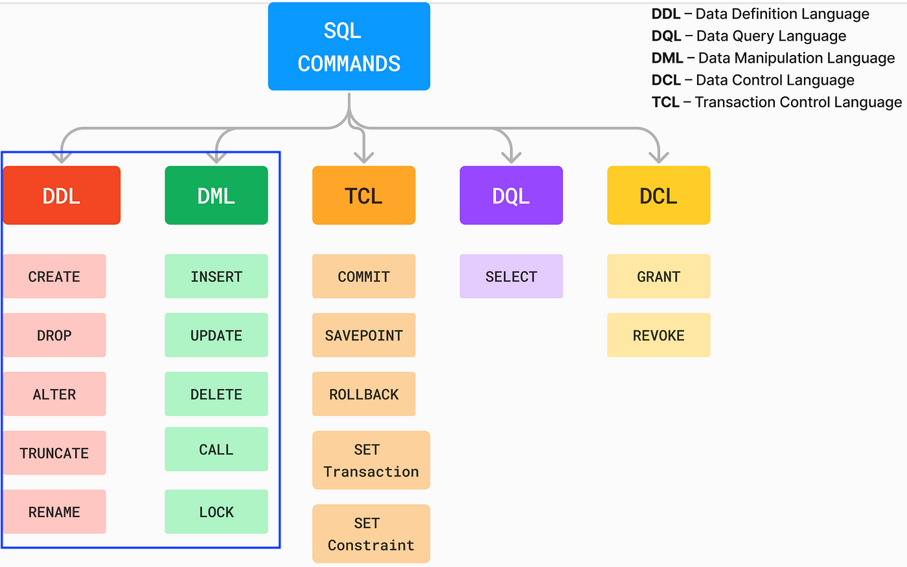

# SQL: DDL & DML

- SQL is a standard language for accessing and manipulating relational databases.
- There are 5 types of SQL commands, such as DDL, DML, TCL, DQL, and DCL.
    
- Here, we only focus on DDL and DML

## DDL

- DDL statements are responsible for creating, altering, and dropping database objects such as tables, views, indexes, and constraints.
- Commonly used DDL statements:
  - CREATE
  - ALTER
  - DROP
  - TRUNCATE

## DML

- DML statements are responsible for inserting, updating, deleting, and retrieving data from database tables.
- DML consists of:
  - INSERT
  - UPDATE
  - DELETE

## References

- FTDS Colab <https://colab.research.google.com/github/FTDS-learning-materials/phase-0/blob/main/w2/P0W2D2AM_SQL_%20DDL%20%26%20DML.ipynb>
- Different types of SQL command <https://medium.com/@reetesh043/different-types-of-sql-commands-2acc78318c61>